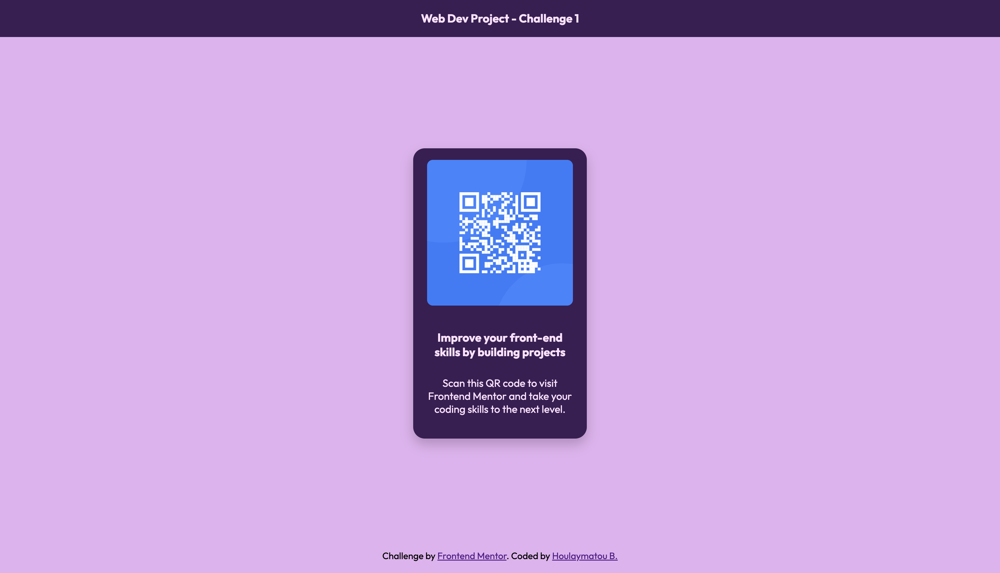

# QR Code Component 💻

This is my solution to the [QR code component challenge on Frontend Mentor](https://www.frontendmentor.io/challenges/qr-code-component-iux_sIO_H).

## Built With 🛠️

- Semantic HTML5
- CSS3 (Custom Properties, Flexbox)
- Modern CSS Practices (e.g., CSS Variables for reusable colors)

## What I learned/practiced 📚

This project allowed me to:

- Practice semantic HTML structure by building a simple and accessible layout.
- Use CSS Flexbox to center elements horizontally and vertically, and CSS variables for reusable and maintainable styles.
- Implement responsive design principles by limiting the width of the card and ensuring its content looks good on all screen sizes.

## Continued Development 👩🏽‍💻

In the future, I aim to:

- Make the component more interactive using JavaScript.
- Explore CSS Grid as an alternative layout method for similar projects.

## Acknowledgments 🫶🏾

I was inspired by the amazing work of [Ekatherin](https://github.com/catherineisonline) and [Aniqa](https://github.com/aniqatc) on GitHub ✨. Their dedication and creativity motivated me to take on this challenge 👩🏽‍💻🎯.
