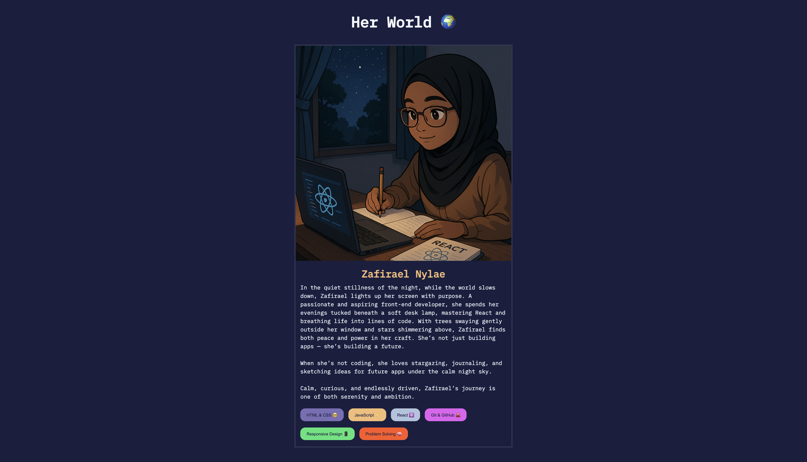

# Her World 🌍 - React Profile Card

A simple React project designed to showcase foundational concepts like components, props, and JSX — all through the lens of a fictional developer’s world 🤓.

## 🚀 Project Overview

This project introduces Zafirael Nylae, a fictional aspiring front-end developer, through an interactive React-based profile interface.

## 📋 Features

- Responsive design that works across different screen sizes
- Component-based architecture with proper separation of concerns
- Dynamic skill buttons rendered from data array
- Custom styling with a night-themed color palette

## 🧩 Component Structure

The project is organized into the following components:

- **App**: Root component that renders the main application container
- **Card**: Container component that brings together the profile elements
- **Avatar**: Displays the profile image
- **Header**: Displays the name of the profile
- **Bio**: Contains the profile description and skills
- **SkillBtn**: Reusable button component that receives props for customization

## 🛠️ Technologies Used

- React
- CSS
- JavaScript

## 🔍 Key React Concepts Demonstrated

### Component Composition

The project demonstrates how to break down a UI into reusable components and compose them together to create a complete interface.

### Props

The SkillBtn component showcases props usage by accepting and utilizing:

- `skill`: The text to display on the button
- `emoji`: An emoji icon to display alongside the text
- `color`: Dynamic background color for the button

### List Rendering

The Bio component demonstrates rendering lists in React by mapping through an array of skill objects and creating SkillBtn components for each item.

## 📚 What I Learned

Through this project, I practiced:

- Creating and structuring React components
- Passing and using props
- Utilizing array mapping to render lists of components
- Implementing responsive design with CSS
- Managing component relationships

## 🙏🏾 Acknowledgments

- Instructor: Jonas Schmedtmann
- Course: The Ultimate React Course
- Where: On Udemy
- My Rating: 🌟🌟🌟🌟🌟 ( so far )

---

_✨ Built with curiosity, creativity, and quiet determination 🫶🏾_
Happy learning n coding! 💻🌌
