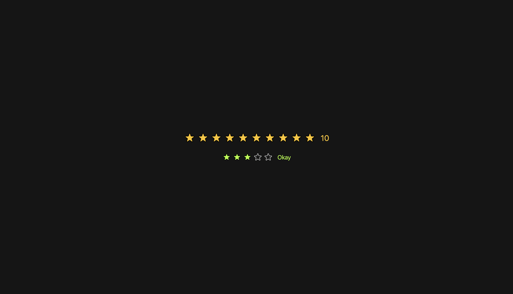

# Star Rating Component 🌟

A customizable and interactive star rating component built with React. This component allows users to rate items with a visual star interface, complete with hover effects and customizable styling.



The gif displays two star rating instances:

- A 10-star rating with black stroke
- A 5-star rating with custom colors, default rating of 3, and text messages

## Features ✨

- **Interactive Rating**: Click on stars to set a rating
- **Hover Effects**: Visual feedback when hovering over stars
- **Customizable Appearance**: Adjust colors, size, and maximum rating
- **Text Messages**: Display custom messages for each rating level
- **Default Rating**: Set an initial rating value

## Props ❊

| Prop            | Type     | Default   | Description                                    |
| --------------- | -------- | --------- | ---------------------------------------------- |
| `maxRating`     | number   | 5         | Maximum number of stars                        |
| `defaultRating` | number   | 0         | Initial rating value                           |
| `color`         | string   | "#fcc419" | Fill color for selected stars                  |
| `strokeColor`   | string   | "#000"    | Stroke color for star outlines                 |
| `size`          | number   | 40        | Size of stars in pixels                        |
| `messages`      | array    | []        | Array of messages corresponding to each rating |
| `onSetRating`   | function | undefined | Callback function when rating changes          |

## Component Structure 🗂️

```
StarRating/
├── Components/
│   ├── StarRating.jsx    # Main component
│   └── Star.jsx          # Individual star component
├── App.jsx               # Demo implementation
└── index.css             # Styling
```

## Technical Implementation 👩🏽‍💻

- Built with React hooks (`useState`)
- Uses SVG for crisp star rendering
- Implements PropTypes for type checking
- Modular component structure for reusability

## Future Enhancements 💡

Potential improvements could include:

- Half-star ratings
- Animation transitions

---

_✨ Every star counts in the journey of learning ⭐ Keep building, keep growing and reach the stars 🌟💻🌌_
