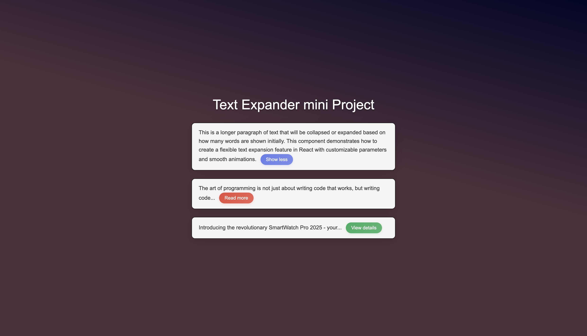

# Text Expander 📖 - React Component Library

A flexible React component for truncating and expanding text content with smooth animations and customizable styling ✨.

## 🚀 Project Overview

This mini project features a reusable TextExpander component that handles long text content by providing users with the ability to show/hide portions of text. Perfect for article previews, product descriptions, and any content where space is at a premium!

## 🧩 Component Structure

The project is organized into the following components:

- **App**: Root component that demonstrates multiple TextExpander instances
- **TextExpander**: The main reusable component with extensive customization options
- **Enhanced Styling**: Modern CSS with backdrop filters and smooth animations

## 🛠️ Technologies Used

- React JS
- CSS3
- JavaScript

## 🎛️ TextExpander Props

| Prop                 | Type    | Default       | Description                            |
| -------------------- | ------- | ------------- | -------------------------------------- |
| `children`           | string  | required      | The text content to be displayed       |
| `className`          | string  | `"box"`       | CSS class for styling the container    |
| `collapsedNumWords`  | number  | `25`          | Number of words to show when collapsed |
| `collapsed`          | boolean | `true`        | Initial collapsed state                |
| `expandButtonText`   | string  | `"Show more"` | Text for the expand button             |
| `collapseButtonText` | string  | `"Show less"` | Text for the collapse button           |
| `buttonColor`        | string  | `"#667eea"`   | Color theme for the toggle button      |
| `animationDuration`  | number  | `300`         | Duration of animations in milliseconds |

## 📚 Key Learning Points

- **React State Management** - Using `useState` hooks for component state
- **Component Reusability** - Creating flexible components with comprehensive props
- **Props Pattern** - Extensive prop system with default values and customization
- **String Manipulation** - Working with JavaScript string methods for text truncation
- **Modern CSS** - Implementing glass-morphism, gradients, and smooth transitions
- **Responsive Design** - Media queries for optimal mobile experience
- **Event Handling** - Managing user interactions with smooth state transitions

## 🙏🏾 Acknowledgments

- Instructor: Jonas Schmedtmann
- Course: The Ultimate React Course
- Where: On Udemy
- My Rating: 🌟🌟🌟🌟🌟 ( so far )

---

_✨ Less is more, but sometimes more is needed 📖 Expand your possibilities 🫶🏾. Happy learning n coding! 💻🌌_
